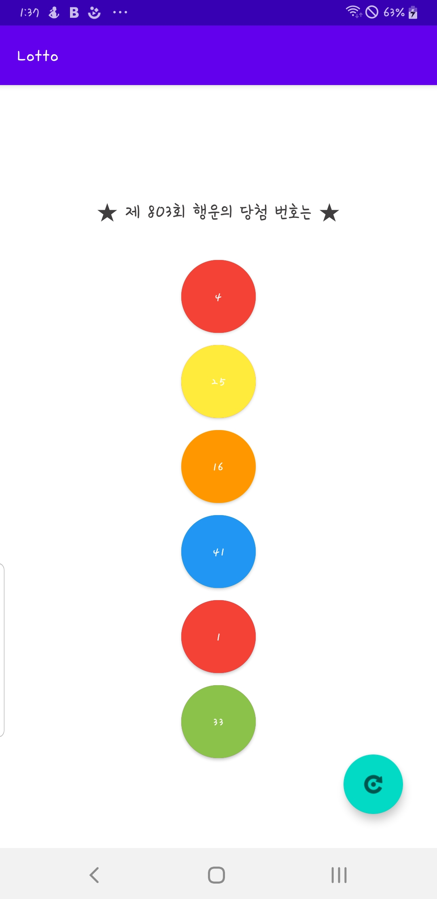

# 로또번호 추첨 앱 만들기

## 코틀린 함수 
fun 함수이름(입력값) {
  함수 내용
	return 반환값
}
## 로또번호추첨앱 기능 완성하기
* 번호 겹치지 않도록 설정하기 
* 배경색 바꾸는 조건문 추가하기
package com.example.lotto

import android.content.res.ColorStateList
import android.graphics.Color
import androidx.appcompat.app.AppCompatActivity
import android.os.Bundle
import android.widget.Button
import com.google.android.material.floatingactionbutton.FloatingActionButton
import java.util.*

class MainActivity : AppCompatActivity() {
    val random = Random()  //랜덤값 사용할 수 있도록 선언
    val numbers = arrayListOf<Int>() // 중복 제거를 위한 숫자 배열 선언

    override fun onCreate(savedInstanceState: Bundle?) {
        super.onCreate(savedInstanceState)
        setContentView(R.layout.activity_main)

        //변수 사용
        val runButton = findViewById<FloatingActionButton>(R.id.FloatingActionButton)
        val buttonNum1 = findViewById<Button>(R.id.buttonNum1)
        val buttonNum2 = findViewById<Button>(R.id.buttonNum2)
        val buttonNum3 = findViewById<Button>(R.id.buttonNum3)
        val buttonNum4 = findViewById<Button>(R.id.buttonNum4)
        val buttonNum5 = findViewById<Button>(R.id.buttonNum5)
        val buttonNum6 = findViewById<Button>(R.id.buttonNum6)

        // 버튼 클릭 이벤트
        runButton.setOnClickListener {
            // 숫자 배열 초기화
            numbers.clear()
            // 반복문을 이용한 버튼 초기화
            for (n in listOf(
                buttonNum1,
                buttonNum2,
                buttonNum3,
                buttonNum4,
                buttonNum5,
                buttonNum6
            )) {
                n.text = ""
                n.backgroundTintList = ColorStateList.valueOf(Color.rgb(242, 242, 242))
            }
        }

        findViewById<FloatingActionButton>(R.id.FloatingActionButton).setOnClickListener {
            numbers.clear()

            setLottoNum(buttonNum1)
            setLottoNum(buttonNum2)
            setLottoNum(buttonNum3)
            setLottoNum(buttonNum4)
            setLottoNum(buttonNum5)
            setLottoNum(buttonNum6)

        }
    }

    // 로또 번호 설정 함수
    fun setLottoNum(lottoNum: Button) {
        // 랜덤값 생성
        var num = random.nextInt(45) + 1
        // 숫자 배열 numbers에 num이 포함되어 있을 경우 다시 랜덤값 생성
        while (numbers.contains(num)) {
            num = random.nextInt(45) + 1
        }
        // 숫자 배열 numbers에 num 추가
        numbers.add(num)
        //번호 및 배경색 설정
        lottoNum.text = "${num}"

        if (num <= 10) {
            lottoNum.backgroundTintList = ColorStateList.valueOf(Color.rgb(244,67,54))
        } else if (num <= 20) {
            lottoNum.backgroundTintList = ColorStateList.valueOf(Color.rgb(255,152,0))
        } else if (num <= 30) {
            lottoNum.backgroundTintList = ColorStateList.valueOf(Color.rgb(255,235,59))

        } else if (num <= 40) {
            lottoNum.backgroundTintList = ColorStateList.valueOf(Color.rgb(139,195,74))

        } else {
            lottoNum.backgroundTintList = ColorStateList.valueOf(Color.rgb(33,150,243))
        }

    }
}

