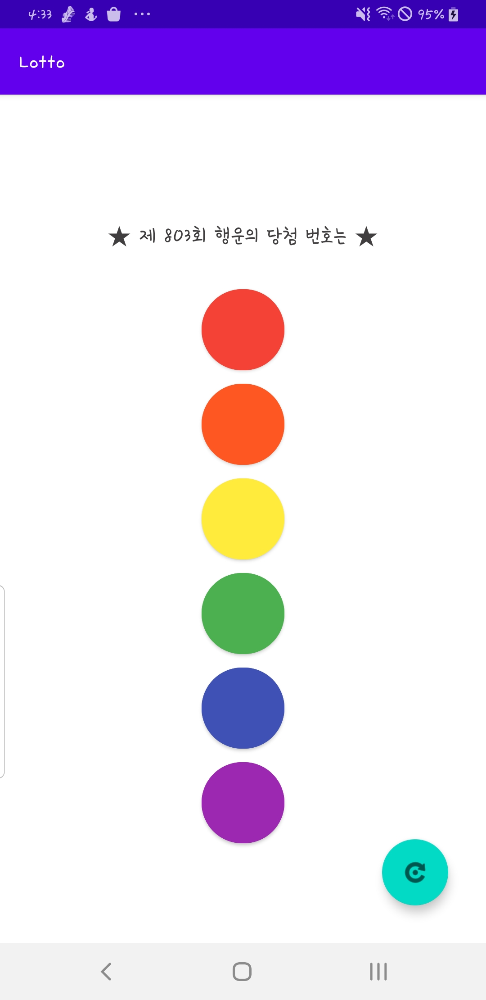

# 로또번호 추첨 앱 만들기 
## 레이아웃 추가하기

 Layout 중첩하기 - Linear Layout 사용하기

Constraint Layout 안에 Linear Layout 을 중첩
<?xml version="1.0" encoding="utf-8"?>
<androidx.constraintlayout.widget.ConstraintLayout xmlns:android="http://schemas.android.com/apk/res/android"
    xmlns:app="http://schemas.android.com/apk/res-auto"
    xmlns:tools="http://schemas.android.com/tools"
    android:layout_width="match_parent"
    android:layout_height="match_parent"
    tools:context=".MainActivity">

    <com.google.android.material.floatingactionbutton.FloatingActionButton
        android:id="@+id/FloatinActionButton"
        android:layout_width="wrap_content"
        android:layout_height="wrap_content"
        android:layout_marginEnd="32dp"
        android:layout_marginBottom="32dp"
        android:clickable="true"
        app:layout_constraintBottom_toBottomOf="parent"
        app:layout_constraintEnd_toEndOf="parent"
        app:srcCompat="@android:drawable/ic_menu_rotate"/>

    <LinearLayout
        android:layout_width="match_parent"
        android:layout_height="match_parent"
        android:gravity="center"
        android:orientation="vertical"
        app:layout_constraintBottom_toBottomOf="parent"
        app:layout_constraintEnd_toEndOf="parent"
        app:layout_constraintHorizontal_bias="1.0"
        app:layout_constraintStart_toStartOf="parent">

        <TextView
            android:id="@+id/textView"
            android:layout_width="wrap_content"
            android:layout_height="80dp"
            android:gravity="center"
            android:text="★ 제 803회 행운의 당첨 번호는 ★"
            android:textAppearance="@style/TextAppearance.AppCompat.Large"
            android:textColor="#403E3E"
            android:textColorHighlight="#050505" />

        <Button
            android:id="@+id/buttonNum1"
            android:layout_width="70dp"
            android:layout_height="80dp"
            android:backgroundTint="#F44336"
            android:gravity="center"
            app:cornerRadius="80dp" />

        <Button
            android:id="@+id/buttonNum2"
            android:layout_width="70dp"
            android:layout_height="80dp"
            android:backgroundTint="#FF5722"
            android:gravity="center"
            app:cornerRadius="80dp" />

        <Button
            android:id="@+id/buttonNum3"
            android:layout_width="70dp"
            android:layout_height="80dp"
            android:backgroundTint="#FFEB3B"
            android:gravity="center"
            app:cornerRadius="80dp" />

        <Button
            android:id="@+id/buttonNum4"
            android:layout_width="70dp"
            android:layout_height="80dp"
            android:backgroundTint="#4CAF50"
            android:gravity="center"
            app:cornerRadius="80dp" />

        <Button
            android:id="@+id/buttonNum5"
            android:layout_width="70dp"
            android:layout_height="80dp"
            android:backgroundTint="#3F51B5"
            android:gravity="center"
            app:cornerRadius="80dp" />

        <Button
            android:id="@+id/buttonNum6"
            android:layout_width="70dp"
            android:layout_height="80dp"
            android:backgroundTint="#9C27B0"
            android:gravity="center"
            app:cornerRadius="80dp" />

    </LinearLayout>

</androidx.constraintlayout.widget.ConstraintLayout>

