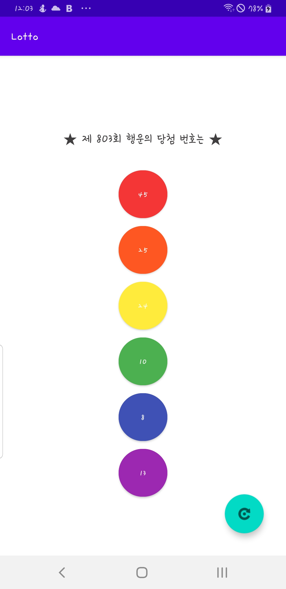

# 로또번호 추첨 앱 만들기

## 코드로 디자인 바꾸기

* 컴포넌트를 변수로 지정하기
* 코틀린 코드로 텍스트 변경하기
* 코틀린 코드로 배경색 변경하기

MainaActivity.kt
package com.example.lotto

import android.content.res.ColorStateList
import android.graphics.Color
import androidx.appcompat.app.AppCompatActivity
import android.os.Bundle
import android.widget.Button
import com.google.android.material.floatingactionbutton.FloatingActionButton

class MainActivity : AppCompatActivity() {
    override fun onCreate(savedInstanceState: Bundle?) {
        super.onCreate(savedInstanceState)
        setContentView(R.layout.activity_main)
        
        # 컴포넌트를 변수로 지정하기
        val FloatingActionButton = findViewById<FloatingActionButton>(R.id.FloatingActionButton)
        val butonNum1 = findViewById<Button>(R.id.buttonNum1)
        val butonNum2 = findViewById<Button>(R.id.buttonNum2)
        val butonNum3 = findViewById<Button>(R.id.buttonNum3)
        val butonNum4 = findViewById<Button>(R.id.buttonNum4)
        val butonNum5 = findViewById<Button>(R.id.buttonNum5)
        val butonNum6 = findViewById<Button>(R.id.buttonNum6)

        FloatingActionButton.setOnClickListener {
            butonNum1 .text = "45" #텍스트 설정
            butonNum1 .backgroundTintList = ColorStateList.valueOf(Color.rgb(244,54,54))#배경색 바꾸기

            butonNum2.text = "25"
            butonNum2.backgroundTintList = ColorStateList.valueOf(Color.rgb(255,87,34))

            butonNum3.text = "24"
            butonNum3.backgroundTintList = ColorStateList.valueOf(Color.rgb(255,235,59))

            butonNum4.text = "10"
            butonNum4.backgroundTintList = ColorStateList.valueOf(Color.rgb(76,175,80))

            butonNum5.text = "8"
            butonNum5.backgroundTintList = ColorStateList.valueOf(Color.rgb(63,81,181))

            butonNum6.text = "13"
            butonNum6.backgroundTintList = ColorStateList.valueOf(Color.rgb(156,39,176))

        }
    }
}

⭐ 코틀린에서 val은 변하지 않는 변수. (상수와는 또 다른 개념입니다.)  
  
아무렇게나 변할 수 있는 변수는 var로 선언.

변수 :  데이터를 저장해두는 공간으로 숫자 문자 컴포넌트 등을 저장해두고 언제든지 사용할 수 있음. 코틀린에서는 보통 컴포넌트를 변수로 지정해두고 사용 

