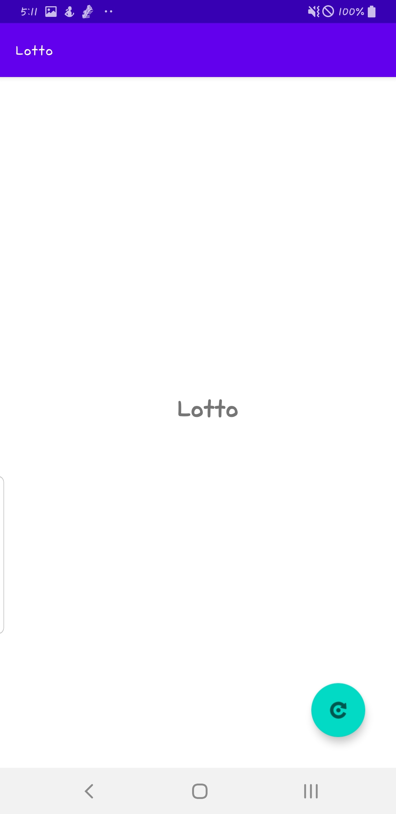

## 내 생애 첫 안드로이드 

### #6  안드로이드 스튜디오 구조 이해하기 

**AndroidManifest.xml**  
  
앱의 전체 구성 정보를 담고 있는 파일  
액티비티의 개수, 앱 첫 화면 담당할 액티비티가 무엇인지, 권한 허용 등의 코드 포함

**MainActivity.kt,activity_main.xml**  
  
액티비티, 화면 구성하는 파일  
.xml은 레이아웃(앱 디자인)을 담당하는 파일  
.kt 파일은 화면에 대한 코드(코틀린) 작성하는 파일  
둘은 짝꿍으로 이름 지을 때 파일 이름이 00Activity면 activity_000으로 명명

**build.gradle(프로젝트 수준, 모듈 수준)**  
  
Gradle Scripts 부분에 있는 build.gradle 파일 2개도 중요한 파일   
빌드 : 프로젝트 설치 가능한 앱으로 만들기 위한 과정  
빌드 위해 필요한 설정들을 작성하는 곳  
프로젝트 수준의 build.gradle 파일이 있고  
모듈 수준의 build.gradle 파일이 있음  

**activity_main.xml**
  
* 코드모드 : 모드로 레이아웃 수정하고 확인
* 스플릿모드: 코드와 디자인 모드 반반 볼 수 있는 모드
* 디자인모드: 그래필 UI로 xml파일 수정할 수 있는 모드

### #7  Constarint Layout

Layout은 여러 컴포넌트(View)를 묶어주는 뷰그룹(View group)
  
* Linear Layout  
   
단어처럼 컴포넌트들을 순차적으로 나열  
가로로 나열할지, 세로로 나열할지 선택  
orientation 속성이 vertical 이면 세로로 나열,horizontal이면 가로로 나열  
  
  
    
* Frame Layout  
  
액자 안에 그림을 끼우는 방식으로 컴포넌트를 배치  
액자 안에 그림 여러 장을 끼우면 가장 마지막에 끼운 것만 보이듯이,  
Frame Layout에 배치한 것 중에 가장 마지막 (가장 밑에 있는) 컴포넌트가 보입니다.  
  
    
* Constraint Layout   
  
컴포넌트의 상하좌우에 필요한 제약을 추가하여 원하는 위치에 배치  

### 로또번호 추첨 앱 만들기 - 레이아웃 만들기 
<?xml version="1.0" encoding="utf-8"?>
<androidx.constraintlayout.widget.ConstraintLayout xmlns:android="http://schemas.android.com/apk/res/android"
    xmlns:android="http://schemas.android.com/apk/res/android"
    xmlns:app="http://schemas.android.com/apk/res-auto"
    xmlns:tools="http://schemas.android.com/tools"
    android:layout_width="match_parent"
    android:layout_height="match_parent"
    android:clipToPadding="true"
    tools:context=".MainActivity">

    <TextView
        android:id="@+id/textView"
        android:layout_width="wrap_content"
        android:layout_height="wrap_content"
        android:layout_marginTop="324dp"
        android:layout_marginEnd="164dp"
        android:text="Lotto"
        android:textSize="34sp"
        android:textStyle="bold"
        app:layout_constraintEnd_toEndOf="parent"
        app:layout_constraintLeft_toLeftOf="parent"
        app:layout_constraintRight_toRightOf="parent"
        app:layout_constraintTop_toTopOf="parent" />

    <com.google.android.material.floatingactionbutton.FloatingActionButton
        android:id="@+id/FloatinActionButton"
        android:layout_width="wrap_content"
        android:layout_height="wrap_content"
        android:layout_marginEnd="32dp"
        android:layout_marginBottom="32dp"
        android:clickable="true"
        app:layout_constraintBottom_toBottomOf="parent"
        app:layout_constraintEnd_toEndOf="parent"
        app:srcCompat="@android:drawable/ic_menu_rotate"/>

</androidx.constraintlayout.widget.ConstraintLayout>

